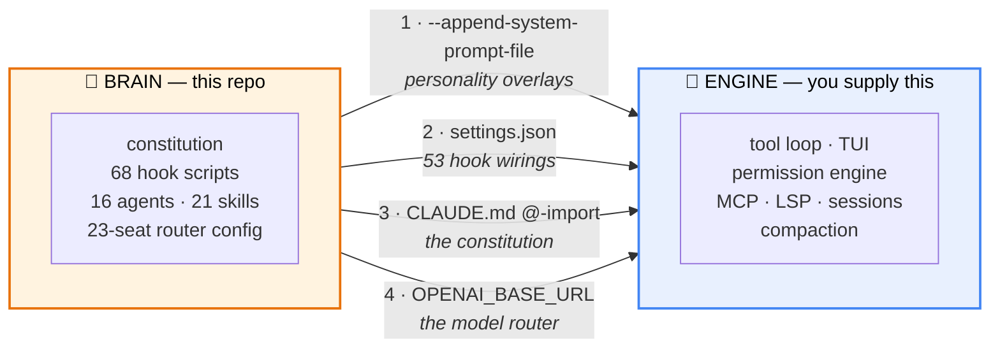
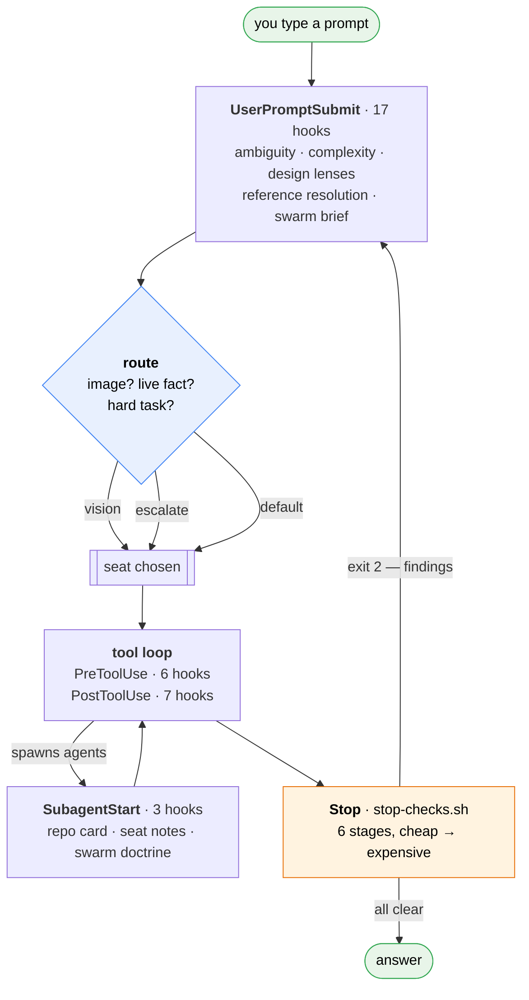
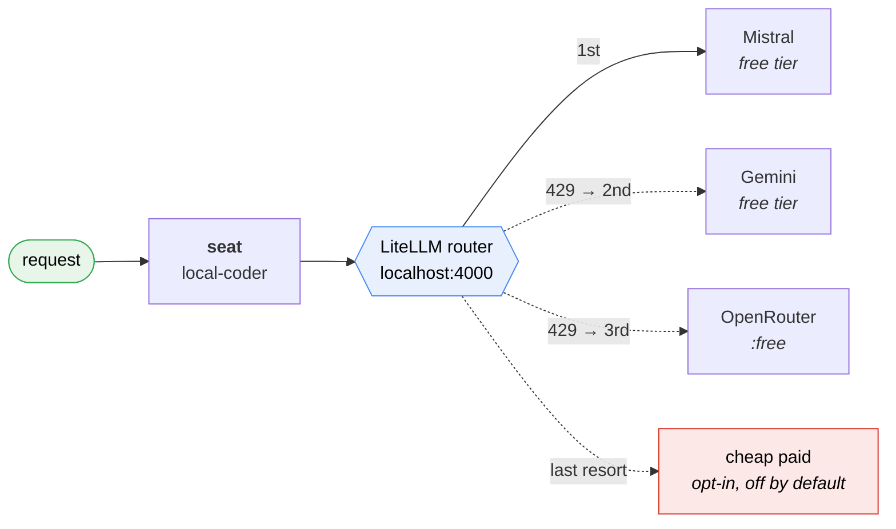
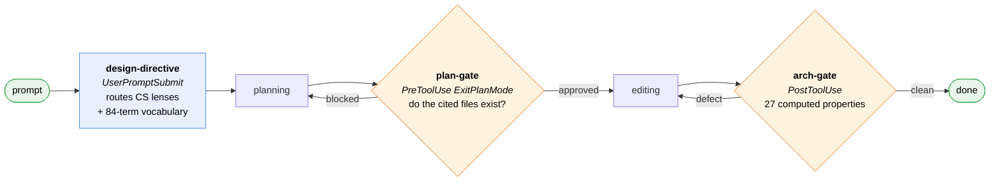
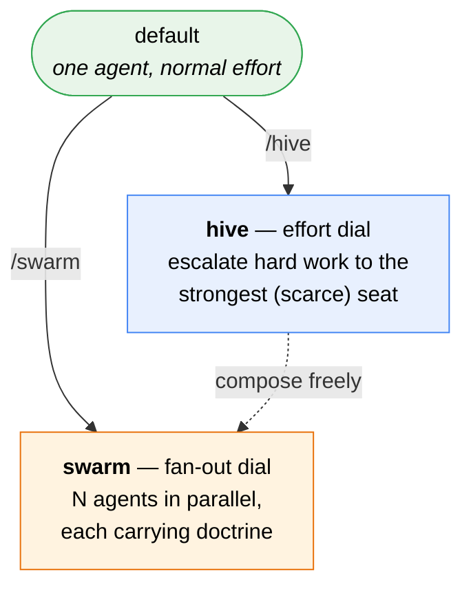

# Serge

A configuration layer that turns a Claude Code–compatible CLI into an opinionated
engineering agent: 23 model seats behind a local router, 53 lifecycle
hook wirings that check the agent's work as it goes, 16 specialist subagents, 21 skills,
and a constitution you write yourself.

Its gates **compute** rather than ask. A dependency cycle is found by running
Tarjan over the import graph, not by requesting that the model consider coupling
— so a plan cannot pass by writing `Security: N/A`.

It runs on free model tiers. A full working setup costs **$0/month**.

<p align="center">
  
</p>

> **Serge is not a contributor to your code.** Git co-authorship ships off. It
> will not add itself as a `Co-Authored-By` trailer, it will not appear in your
> commit history, and it will not show up in your repo's contributor list. That
> is a deliberate default, not an oversight — see [Attribution](#12-attribution).

---

## Table of contents

1. [What this repo is (and is not)](#1-what-this-repo-is-and-is-not)
2. [How it works](#2-how-it-works) — the diagrams
   - [2.5 The gates compute; they do not ask](#25-the-gates-compute-they-do-not-ask)
3. [You supply the engine](#3-you-supply-the-engine)
4. [Prerequisites](#4-prerequisites)
5. [Install — Linux / macOS / Windows](#5-install)
6. [Get your keys](#6-get-your-keys-all-free)
7. [Write your constitution](#7-write-your-constitution)
8. [First run](#8-first-run)
9. [What's actually in the box](#9-whats-actually-in-the-box)
10. [Modes you can switch on](#10-modes-you-can-switch-on)
11. [Optional guardrails](#11-optional-guardrails)
12. [Attribution](#12-attribution)
13. [Troubleshooting](#13-troubleshooting)
14. [Security](#14-security)

---

## 1. What this repo is (and is not)

**It is** the brain: a constitution, hooks, subagent definitions, skills, slash
commands, a LiteLLM router config describing 23 model seats with failover
chains between them, service units, and an installer.

**It is not** the CLI. See the next section — that part you bring yourself.

The distinction matters because the brain is where all the behaviour lives. The
engine is a fairly ordinary agent loop; what makes it behave like Serge is the
pile of hooks that fire on 13 lifecycle events, the router that puts the right
model on the right job, and the constitution that shapes every turn.

**Everything here ships empty of state.** No API keys, no memories, no session
history, no constitution content. You start from zero and it becomes yours.

## 2. How it works

Three diagrams. If you read nothing else, read the first one — it explains why
this repo contains no program.

### 2.1 Two layers, four channels

Serge is a **brain** bolted onto an **engine**. They overlap in exactly four
places, and everything Serge does to the engine goes through one of them.



The engine is an ordinary agent loop. What makes it behave like Serge is the
pile of hooks, the router that puts the right model on the right job, and the
constitution shaping every turn.

**Why this matters to you:** almost every behaviour you might want to change is
a shell script in `~/.serge`, not engine code you don't have. Editing one takes
effect on your **next prompt** — there is nothing to rebuild.

### 2.2 What each layer owns

The overlap is small and deliberate. Anything in the middle column is a place
the two layers have to agree, and therefore a place things can silently break.

| Engine owns (you supply) | ⟷ The four channels ⟷ | Brain owns (this repo) |
|---|---|---|
| running tools | `settings.json` hook wirings | *when* a tool is allowed |
| the model call | `OPENAI_BASE_URL` → router | *which model* answers |
| the system prompt | `--append-system-prompt-file` | *what it says* |
| loading `CLAUDE.md` | the `@`-import chain | *the constitution's content* |
| compaction, sessions, MCP, TUI | — | subagents, skills, commands, doctrine |

### 2.3 One turn, end to end

Every prompt passes through five phases. Each can add context, block the turn,
or send it back around.



The loop back from **Stop** is the important edge. When a check fails, the turn
does not just report — it **re-enters the model with the finding attached**.
That is how unattended runs correct themselves.

The Stop pipeline runs its six stages in **one process, cheapest first**,
because sibling hooks run in parallel and would otherwise finish in random
order:

| Stage | Cost | Does |
|---|---|---|
| 0 · persistence | ms, no model | catches "I'll do it next turn" endings |
| 0.5 · link check | ms, network only if needed | catches invented URLs |
| 0.6 · claims gate | ms, no model | catches "done" claims nothing verified |
| 1 · verify | typecheck + lint | blocking; skips stage 2 if it fails |
| 2 · review | one cheap model call | reads the diff |
| 3 · constitution gate | ms unless doctrine changed | eval regression check |

Stages 0, 0.5 and 0.6 cost nothing — no model call, no network unless a URL
actually needs checking. They run first on purpose: the cheapest checks catch the
most common failure, which is not a wrong answer but a **premature** one.

### 2.4 Which model answers

You never name a model. You name a **seat**, and the router decides who fills
it — failing over silently if the first choice is rate-limited.



Two consequences worth internalising:

- **A 200 response does not mean the seat you asked for answered.** A cooled
  deployment fails over silently. `~/.serge/seat-health.sh` is how you check —
  it compares the answering model against the seat's own configuration.
- **Chains are forward-only.** Each seat's fallback list ends somewhere
  terminal, so a walk can never loop between two exhausted providers.

### 2.5 The gates compute; they do not ask

Most agent guardrails are written as instructions: *consider security, think
about scale, watch your complexity.* An instruction is satisfied by writing
`Security: N/A` — which is why a checklist tends to certify exactly the work it
was meant to catch.

Serge's gates are ordered by how hard they are to fake, and the weight sits on
the top two rungs.

| Rung | Derived from | Fakeable? |
|---|---|---|
| **computed** — cycles, coupling, complexity, dead tests | the import graph and the AST | no |
| **grounded** — cited files exist, commands really ran | the filesystem, the turn's own record | no |
| **structural** — depth vs blast radius, a check per step | arithmetic on the plan | weakly |
| **prose** — the routed design questions | reading the text | yes |

Three gates sit at the three moments that matter:



**`arch-gate`** computes, on every edit: dependency cycles (Tarjan over the
import graph), layering violations, orphan and self-referential modules, god
objects, coupling and instability, cyclomatic complexity, swallowed errors,
unhandled rejections, unbounded network calls, missing idempotency on retried
writes, N+1 queries, missing transaction boundaries, unindexed filters,
migrations with no rollback, tests that cannot fail, untested modules,
unauthorized mutation routes, trust-boundary crossings, and removable bulk.

It follows the **write, not the tool**. Source written through the shell — a
heredoc, a redirect, `tee`, `sed -i`, `cp` — used to bypass every code gate,
because they all matched only `Edit|Write|MultiEdit`.

**`plan-gate`** fires before *you* are asked to approve a plan. Its strongest
check is the cheapest: every file the plan cites must exist. A plan naming
`src/services/auth.ts` in a repo with no such file was written from imagination,
and that one check catches the whole class.

**Neither can trap a session.** Both block once per distinct finding-set; a
changed set blocks again, and a repeat objection arrives as context instead. A
gate with no memory turns into an edit-block-edit loop with no exit.

Everything above is tested against a corpus of planted defects, and each suite
carries a `--self-test` that swaps the checker for a stub and asserts the suite
**fails**:

```bash
python3 ~/.serge/lib/archscan_test.py --self-test   # 42-case corpus
bash    ~/.serge/lib/gates_test.sh    --self-test   # 23 hook behaviours
```

A suite that still passes when the checker is removed is not testing the checker.

## 3. You supply the engine

This repo contains no CLI binary or source, on purpose. The installer expects an
engine to already be present and wires the brain onto it:

```bash
./install.sh --engine /path/to/your/engine
```

You have two options.

**[serge-engine](https://github.com/robsevo/serge-engine) — MIT, purpose-built.**
A companion project that implements exactly the contract below: an
OpenAI-compatible agent loop, all 13 hook events, a permission system, and JSONL
transcripts the gates in this repo re-read. It runs interactive sessions with
resume, loads the skills, slash commands and **subagent definitions** in this
repo — running each specialist on the seat its definition names — speaks MCP
over stdio, HTTP and SSE, and branches sessions. Its TUI is React and Ink, the
same stack the derived engine uses: finished turns are committed to scrollback
once and never redrawn, so only the live region — spinner, mascot, status line —
repaints. Pressing `/` opens a command menu carrying this repo's own
`commands/*.md` alongside the built-ins, streams the reply as it arrives,
renders markdown, prompts for permission rather than refusing silently, and
searches and reads the web — behind an SSRF guard that resolves each hop and
refuses private, loopback and cloud-metadata addresses. It runs long-lived
commands in the background, so a dev server or a watcher no longer blocks the
turn, and everything it started is killed when the session ends. Every exit
prints the command that resumes the session. It never calls Anthropic. What it does not do
yet: mouse support, and OAuth for remote MCP servers.

```bash
git clone https://github.com/robsevo/serge-engine
( cd serge-engine && npm run build )
./install.sh --engine ../serge-engine
```

**A Claude Code–derived engine — interactive, not redistributable.** That code is
Anthropic's proprietary software, which is why this repo cannot ship it. If you
have one, point the installer at it.

### 3.1 Why two repos, and how to pair them

Brain and engine are **separate repositories on purpose**, and the reason is not
tidiness — it is that they have different licences, different release rhythms,
and different audiences.

| | serge-brain | serge-engine |
|---|---|---|
| what it is | configuration: hooks, gates, skills, router config | a runtime: agent loop, tools, permissions |
| changes when | you change how the agent should *behave* | you change what the agent *can do* |
| can be swapped | no — it is the product | yes — any conforming engine works |
| licence | MIT | MIT |

A monorepo would couple them: every hook tweak would ship a new engine, and the
brain could no longer claim to run on *any* conforming engine — which is the
property that lets you keep a Claude Code derivative underneath if you prefer it.

**The recommended pairing** — two clones, side by side:

```bash
git clone https://github.com/robsevo/serge-brain
git clone https://github.com/robsevo/serge-engine

( cd serge-engine && npm run build )
( cd serge-brain  && ./install.sh --engine ../serge-engine )
```

That is the whole integration. `install.sh` verifies the engine answers
`--version`, resolves the hook paths into `~/.serge/settings.json`, and stops
before writing a key or starting a service.

**Try it without touching an existing install** — the installer supports a
separate home, so a trial costs you nothing:

```bash
SERGE_HOME=~/.serge-trial ./install.sh --engine ../serge-engine
SERGE_HOME=~/.serge-trial serge -p "reply with: ok"
```

**Pinning.** The two repos meet at a contract, not an API: the 13 hook events,
the payload fields, the JSONL transcript shape, and the deny protocols. That
contract is versioned in
[`docs/ENGINE-CONTRACT.md`](https://github.com/robsevo/serge-engine/blob/main/docs/ENGINE-CONTRACT.md)
in the engine repo, and it is *generated by observing a running engine* rather
than written by hand. If you pin, pin both to the same contract revision.

The engine needs to be Claude Code–compatible: it must read `CLAUDE_CONFIG_DIR`
for its config directory, support `settings.json` hooks, and accept an
OpenAI-compatible base URL so the router can sit in front of it. Serge sets
`CLAUDE_CONFIG_DIR=~/.serge` so it never collides with a real Claude Code
install on the same machine — you can run both.

If your engine is Claude Code itself, most of this works as-is; a few hooks use
events that may not exist in every version, and those degrade to no-ops rather
than failing the turn.

## 4. Prerequisites

| What | Why | Install |
|---|---|---|
| Node.js ≥ 22 | runs the engine | nodejs.org or your package manager |
| LiteLLM (proxy extra) | the model router on `localhost:4000` | `uv tool install 'litellm[proxy]'` |
| curl, python3, perl | health checks, hook helpers, installer rewrites | usually already present |
| **macOS**: GNU coreutils | hooks use GNU `timeout`/`stat`/`sha256sum` | `brew install coreutils` (put gnubin on PATH); loops also need `brew install flock` |
| **Windows**: WSL2 | strongly recommended; native Git Bash works but is less tested | `wsl --install` |
| semgrep *(optional)* | powers the security-scan hook | `uv tool install semgrep` — the hook no-ops without it |

## 5. Install

Pick your platform. All three end at the same place: `~/.serge` populated,
`serge` on your `PATH`, no key written and no service started — those are your
next two steps, deliberately separate so nothing runs before you've looked at it.

```bash
git clone <your-fork-url> serge && cd serge
```

<details open>
<summary><b>🐧 Linux</b> — the reference platform</summary>

```bash
# 1. prerequisites
sudo apt install nodejs npm python3 curl perl    # or dnf/pacman equivalent
curl -LsSf https://astral.sh/uv/install.sh | sh  # for litellm
uv tool install 'litellm[proxy]'

# 2. install the brain onto your engine
./install.sh --engine /path/to/your/engine

# 3. keys, then the router
nano ~/.serge/router.env
systemctl --user enable --now serge-router.service
curl -s http://localhost:4000/v1/models | head    # seats listed?

# 4. go
serge
```

Services are systemd **user** units — no root, and they stop when you log out
unless you enable lingering (`loginctl enable-linger $USER`).
</details>

<details>
<summary><b>🍎 macOS</b> — one extra step that matters</summary>

```bash
# 1. prerequisites — coreutils is NOT optional
brew install node python3 coreutils flock
curl -LsSf https://astral.sh/uv/install.sh | sh
uv tool install 'litellm[proxy]'

# 2. put GNU tools first on PATH, or hooks silently misbehave
echo 'export PATH="$(brew --prefix)/opt/coreutils/libexec/gnubin:$PATH"' >> ~/.zshrc
source ~/.zshrc

# 3. install
./install.sh --engine /path/to/your/engine

# 4. keys, then the router
nano ~/.serge/router.env
launchctl load -w ~/Library/LaunchAgents/com.serge.router.plist
curl -s http://localhost:4000/v1/models | head

# 5. go
serge
```

> **Why coreutils is required.** The hooks use GNU `timeout`, `stat -c` and
> `sha256sum`. BSD versions take different flags, so they don't error loudly —
> they fail in ways that look like the hook simply had nothing to say. You get a
> quieter agent and no clue why. Install coreutils and put `gnubin` first.
</details>

<details>
<summary><b>🪟 Windows — WSL2</b> (recommended)</summary>

```powershell
wsl --install           # then reboot, and open your Linux shell
```

Inside WSL, follow the **Linux** instructions exactly. Two notes:

- Keep the repo and your projects on the **Linux** filesystem (`~/code/...`),
  not `/mnt/c/...`. Cross-filesystem file watching and `stat` calls are slow
  enough to trip hook timeouts.
- systemd works in WSL2 but may need enabling: add `[boot]` / `systemd=true` to
  `/etc/wsl.conf`, then `wsl --shutdown` and reopen. Without it, start the
  router by hand: `litellm --config ~/.serge/litellm.yaml --port 4000`.
</details>

<details>
<summary><b>🪟 Windows — native Git Bash</b> (works, less tested)</summary>

Install [Git for Windows](https://gitforwindows.org), Node ≥ 22 and Python 3,
then from **Git Bash**:

```bash
./install.sh --engine /path/to/your/engine
nano ~/.serge/router.env
litellm --config ~/.serge/litellm.yaml --port 4000 &   # no systemd here
serge
```

The engine executes hooks through Git Bash, so they run. What you lose is the
background automation: no systemd means the router, the budget watchdog and the
loops don't start on their own. `windows/register-serge-tasks.ps1` wires the
router and watchdog to Task Scheduler if you want them; the autonomous loops are
Linux/WSL-only.
</details>

### Platform support, honestly

| | Agent + hooks | Router autostart | Background automation |
|---|---|---|---|
| **Linux** | full | systemd user unit | full — watchdog, timers, loops |
| **macOS** | full *(needs GNU coreutils)* | launchd agent | full — `brew install flock` for loops |
| **Windows · WSL2** | full | systemd (enable in `wsl.conf`) | full |
| **Windows · Git Bash** | full | manual, or Task Scheduler | partial — no loops |

Two portability facts worth stating plainly, because both fail *quietly* rather
than loudly:

- **macOS needs GNU coreutils.** The hooks use GNU `timeout`, `stat -c` and
  `sha256sum`. The BSD versions take different flags, so they don't error —
  they just produce nothing, and a hook that produces nothing looks exactly like
  a hook with nothing to say. `install.sh` checks for this and refuses to
  continue without it.
- **bash 3.2 is supported.** macOS still ships bash 3.2 (2007) as `/bin/bash`,
  and coreutils cannot fix a missing shell builtin. Every shipped script is
  therefore written to 3.2 — no `mapfile`, no `${var,,}`, no associative arrays
  — and the whole set is checked for it. Where GNU and BSD tools genuinely
  differ (`date -r` means different things on each), the script probes the
  capability at runtime rather than guessing from `uname`.

### What the installer does

1. checks prerequisites and stops early if something is missing,
2. installs the **engine's** runtime dependencies if they're absent, then proves
   the engine starts by running `--version` and reading the output,
3. copies `dot-serge/` to `~/.serge`,
4. generates `settings.json` from the template, substituting your real home path
   into every hook command,
5. creates `router.env` and `serge.env` from the blank templates at mode `600`,
6. installs service units (systemd on Linux, launchd on macOS),
7. puts `serge` on your `PATH`.

It will **not** overwrite an existing `~/.serge` unless you pass `--force`
(which backs the old one up first), and it never enables a service or writes a
key — it prints the commands for you to run.

Use `--dry-run` to see all of that without touching anything.

> **Step 2 exists because the engine bundle is not self-contained.**
> `dist/cli.mjs` externalises its native and optional dependencies, so a copied
> engine directory looks complete and then dies on first launch with a module
> resolution error that has nothing to do with Serge. The installer runs the
> engine and reads back a version string, so "installed" means "started once",
> not "files were copied".

**Three flags worth knowing before you run it on a machine you care about:**

```bash
# Evaluate a build WITHOUT touching a working install — full install, separate home.
SERGE_HOME="$HOME/.serge-trial" ./install.sh --engine /path/to/engine

# Replace an install that is CURRENTLY RUNNING. --force alone refuses.
./install.sh --engine /path/to/engine --force --replace-live

# Take over the `serge` command when another install already owns it.
./install.sh --engine /path/to/engine --replace-path
```

The installer writes to two places that are **global and single-slot**:
`~/.serge` and `~/.local/bin/serge`. Each has its own guard, because each has
already caused an outage.

The **live-install guard** is there because `--force` backing up `~/.serge` does
not stop the router that is *already running* from holding the only copy of your
working keys in memory. Restore credentials **before** restarting the router, or
you lose them. `--replace-live` makes you say that out loud.

The **PATH guard** is there because exactly one install can own the `serge`
command. Without it, installing a second build silently repoints your working
`serge` at the new tree — and a release tree ships *without* `node_modules` by
design, so the command starts dying with `ERR_MODULE_NOT_FOUND` the next time
that tree is rebuilt. That failure lands hours after the install that caused it,
with no edit in between. So the installer will not touch an existing `serge` that
belongs to a different install, and a non-default `SERGE_HOME` never claims the
command at all — a trial that takes over the command is not a trial. Re-running
the installer for the same tree still refreshes the link silently, because that
is an upgrade, not a takeover.

> **Why the path substitution step exists:** hook commands run through a shell,
> so `$HOME` *usually* expands. "Usually" isn't good enough across
> bash/zsh/PowerShell, and a hook that silently fails to run is invisible — you
> just get a dumber agent with no error. So paths are resolved once, at install,
> where they can be verified.

### Verifying the install

```bash
~/.serge/seat-health.sh          # are the seats really answering? (spends a few calls)
ls ~/.serge/*.sh | wc -l         # 65 hook scripts
serge -p "say OK"                # end-to-end, no TUI
```

## 6. Get your keys (all free)

Put these in `~/.serge/router.env`. Every one has a no-credit-card free tier.
You do **not** need all five to start — Mistral alone gives you a working agent.

| Key | Where | Free tier | Powers |
|---|---|---|---|
| `MISTRAL_API_KEY` | console.mistral.ai | ~1B tokens/month | **local-coder** (the default workhorse), scout, summarizer, deep-reasoner |
| `GEMINI_API_KEY` | aistudio.google.com | ~20 req/day **per model** | the brain seats (hardest reasoning + vision), classifier, and several fallback buckets |
| `OPENROUTER_API_KEY` | openrouter.ai | 50/day, or 1000/day past $10 lifetime spend | the reviewer seat and the `:free` fallback rung |
| `ZAI_API_KEY` | z.ai | ~1000 req/day, 200K context | the GLM seats (`glm-coder`, `free-scout`) |
| `CEREBRAS_API_KEY` | cloud.cerebras.ai | ~1M tokens/day, but ~30K tokens/**minute** | one small-request text seat only |
| `TAVILY_API_KEY` | app.tavily.com — goes in **`serge.env`**, not router.env | ~1k searches/month | the WebSearch tool |

Then start the router and confirm the seats are live:

```bash
nano ~/.serge/router.env                                   # paste keys
systemctl --user enable --now serge-router.service         # Linux/WSL2
# macOS: launchctl load -w ~/Library/LaunchAgents/com.serge.router.plist
curl -s http://localhost:4000/v1/models | head             # seats listed?
```

**A note on free tiers that will save you a bad afternoon:** quotas are usually
counted per *model*, not per account, and a seat that hits its cap does not
error — it falls through its chain and quietly gets answered by something
weaker. The roster is spread across model IDs specifically to farm separate
quota buckets. `seat-health.sh` exists to catch this; run it after setup:

```bash
~/.serge/seat-health.sh          # probes every seat at realistic request size
```

It reports `ok`, `DRIFT` (a fallback is covering a dead primary), `DOWN`, or
`CTXFAIL` (passes a tiny probe, fails a real one). **`DRIFT` on a seat you never
configured is the normal way a broken key presents itself** — the status code
stays 200 the whole time.

### Paid seats (optional, off by default)

`opus-paid`, `sonnet-paid`, `haiku-paid`, `cheap-paid` and `kimi-coder` read a
**separate** key, `OPENROUTER_PAID_API_KEY`, so paid spend can be capped
independently of the free pool. Leave it blank and everything still works —
those seats just fail loudly if named. One of them (`cheap-paid`) is the last
rung of the failover chains so a total free-tier outage degrades instead of
bricking mid-task; with no paid key it fails cleanly instead.

The budget watchdog enforces a daily cap. Nothing bills unless you opt in.

> Free tiers frequently train on their inputs — Google says so explicitly.
> **Never route secrets, credentials, or client code you don't own through the
> free seats.**

## 7. Write your constitution

`~/.serge/CONSTITUTION.md` ships **empty**, with eleven section headings and
notes on what belongs in each — `behavior`, `execution`, `accuracy`,
`delegation`, `memory`, `engineering`, `security`, `debugging`, `coding`,
`identity`, `claims`. It is loaded into every session before your first word,
which makes it the highest-leverage file in the whole system.

An empty constitution is not broken — Serge will behave like a competent stock
agent. Filling it in is what makes it *yours*.

Open it and read the "How to write a section that actually changes behaviour"
preamble first. The short version:

- Be specific enough to be falsifiable. "Write good code" changes nothing.
- Say what to do, not only what to avoid.
- Give the reason — a rule with a "because" survives novel situations.
- Keep it short. Every line is re-sent on every turn, forever.

Start with two or three sections you actually feel strongly about. A 6KB
constitution you enforce beats a 40KB one you aspire to.

> **`## claims` is the one section worth keeping even if you delete the rest.**
> It is the doctrine half of the completion gates in §9 — it defines what Serge
> is allowed to call *done*, *verified*, *tested* or *deployed*, and ties each
> word to evidence that has to exist. The gate enforces the shape; this section
> is where you say what counts as proof in *your* repo.

## 8. First run

```bash
serge
```

Then verify the machinery is actually running, in order:

1. Serge starts and the statusline shows a session cost near $0.
2. Ask something trivial — it should be answered by the workhorse seat.
3. `serge --cloud` routes to the brain seat. (~20 req/day — don't burn it idly.)
4. Make a small code edit and end the turn. The Stop pipeline should fire:
   verify → reviewer reads the diff → gate. **This is the part worth watching** —
   it's the hive checking its own work, and it's the main thing you're installing.
5. `/cost` and `/recap` respond; `/remember <fact>` writes into `~/.serge/memory/`.

If step 4 produces nothing, your hooks aren't wired — see Troubleshooting.

## 9. What's actually in the box

```
dot-serge/
├── CONSTITUTION.md      # empty skeleton — you write this (§7)
├── CLAUDE.md            # loader; @-imports the constitution
├── settings.json.template  # 50 hook wirings across 13 lifecycle events
├── litellm.yaml         # 22 model seats (26 deployments) + failover chains
├── agents/              # 16 specialist subagents
├── skills/              # 21 on-demand capability packs
├── commands/            # 12 slash commands
├── loops/               # 5 autonomous loops (all ship DISABLED)
├── swarm-measures/      # 3 example measures; drop a .md in to add one
├── tests/               # the hooks' own tests — run them after editing a hook
├── memory/              # empty index; Serge fills it in
└── *.sh                 # 65 hook scripts and helper scripts
```

**The seats.** `litellm.yaml` defines 22 named seats (26 deployments) mapped onto free models,
with explicit failover chains. Each seat has a job: a workhorse that drives the
tool loop, a reviewer chosen to be a *different model family* from the workhorse
so its second opinion is actually independent, brain seats for hard reasoning
and vision, a scout for large-context exploration, and paid escape hatches that
only fire when named. Read the comments in that file — they record why each seat
is what it is, including several failures worth not repeating.

**The hooks.** 65 scripts, 50 wirings across 13 events. They inject memory at session start,
add directives when a prompt is ambiguous, gate risky edits, run a reviewer over
your diff when a turn ends, catch stalls, survive compaction, and more. This is
where most of Serge's behaviour actually lives.

**The completion gates.** The failure this system is built hardest against is not
a wrong answer — it's a **confident one**. An agent that says "done, verified,
deployed" without having run anything costs you more than an agent that fails
loudly, because you stop checking. Six gates make a completion claim checkable,
all of them $0 and model-free:

| Gate | Event | Refuses to let the turn end when |
|---|---|---|
| `continue-on-unfinished.sh` | Stop · 0 | the turn ends mid-plan, or a verify command **ran and failed** |
| `url-verify-on-stop.sh` | Stop · 0.5 | a cited URL hard-404s or its host doesn't resolve |
| `claims-gate.sh` | Stop · 0.6 | "done/verified/deployed" appears with no matching evidence |
| `doc-reality-gate.sh` | PostToolUse | a doc names a command, path or flag that doesn't exist |
| `docs-directive.sh` | UserPromptSubmit | a docs task starts without reading the file it rewrites |
| `investigate-directive.sh` | UserPromptSubmit | a question is answered from memory instead of the tree |

The design rule they share: **a gate reads evidence, it does not accept prose.**
A claim of "tests pass" is checked against a command that actually ran in this
turn — a model cannot predict its way past a hash it never computed. Two traps
these were built around, both measured: a `FAILED` matcher that was
case-insensitive scored the "failed" in `0 failed` as a failure and marked green
suites red; and a gate that read the *invocation* rather than the *result*
counted "I ran the tests" as evidence that tests ran.

Every one has an off-switch (an `SERGE_*=0` environment variable, named in the
script's header). They are opinions, not laws — but they default to on, because
the failure they prevent is silent.

**The loops.** Five autonomous loops (nightly regression gate, error triage,
backlog). **All ship disabled.** Read `loops/README.md` before enabling any of
them — an autonomous loop pointed at the wrong repo is the most expensive
misconfiguration available here.

**What ships inert.** There is no `evals/` directory — the eval suite encodes its
author's workloads, so it isn't shipped. Two things therefore start as no-ops and
that is intentional:

- `gate-on-constitution-edit.sh` is a behavioural-regression ratchet. It reads
  the freshest eval evidence and refuses to vouch for stale or partial results.
  With no evidence directory it exits 0 immediately and blocks nothing.
- `serge-loop@eval-gate` has nothing to run.

Both come alive once you create `~/.serge/evals/` with your own golden tasks. The
design principle is worth stealing even if you never do: **the gate reads
evidence, it does not generate it.** An earlier version ran the suite inline and
could take ~3.3 hours inside a hook the harness kills at 480 s — so it blocked
every edit for eight minutes and then wrote a truncated result that the next
reader mistook for a clean verdict.

## 10. Modes you can switch on

Serge's default behaviour is one setting. These are the dials, all off or
neutral until you say otherwise.



They are independent: **hive** decides how *hard* to think, **swarm** decides
how *wide* to go. Neither implies the other.

### `/hive` — effort

Convenes the council (architect + reviewer) on hard work. The architect seat is
free but **scarce** (~20 requests/day), so hive spends it deliberately rather
than on every turn.

### `/swarm` — parallel agents with their own rules

Bare `/swarm` toggles it. While on, two things are injected that otherwise never
exist: the **lead** is told how wide to fan out, and **each subagent** receives a
mini-constitution at spawn.

```bash
/swarm                        # toggle
/swarm agents 5               # up to 5 in parallel
/swarm only reviewer|security # doctrine for those agent types only
/swarm measures               # list measures, see which are on
/swarm measure persistence    # toggle one
/swarm doctrine               # print the doctrine
```

The doctrine lives in `~/.serge/swarm-doctrine.md` and is **yours to edit**.
Optional **measures** are separate files in `~/.serge/swarm-measures/` — drop a
`.md` in and it appears in `/swarm measures` immediately; nothing registers it.
Three ship as examples: `persistence`, `no-speculation`, `frugal`.

> **Keep the doctrine short, and measure it.** It is injected once per spawned
> agent, so its cost is multiplied by the fan-out width. It also gets *less
> effective* as it grows: on a free seat, a 456-word doctrine was followed by
> 1 agent in 6, and trimming it to 110 words — with the required output format
> moved to the top — took that to 11 in 12. `~/.serge/tests/measure-swarm-doctrine.sh`
> re-runs that measurement so a doctrine edit is a question you can answer.

### `/plans` — reopen a shelved plan

Every plan Serge writes is kept. Only the most recent approved one reaches
`plan.md`; the rest sit on the shelf, named by date and title.

```bash
/plans                  # browse
/plans summarize 3      # phases + features, stays in plan mode, asks nothing
/plans 3                # load it, then: proceed? yes / no
/plans --delete 3,7     # to trash (recoverable, self-prunes after 30 days)
```

`summarize` is the low-friction path: it reads the plan's real structure, tells
you the phases and what it delivers, and then **stops** — no question, no menu.

### `/learn` — and the skills that write themselves

`/learn <path|module|area>` reads a batch of code and persists a digest to
`~/.serge/memory/`, so the next session starts already knowing it rather than
re-deriving it from scratch. Delegation is built in: on a large target the
read-heavy discovery goes to scout subagents, and only the conclusions and
`file:line` refs come back.

Underneath it, skills grow on their own. Two capture hooks journal *learning
moments* — never blocking, never calling a model:

| Signal | Captured when |
|---|---|
| `CORRECTION` | you tell Serge it got something wrong |
| `GAP` | you ask for something no skill covers |
| `LOOKED-UP` | Serge itself hit something it didn't know and went to read about it |
| `HARD-WAY` | the same tool failed repeatedly against one target, then succeeded |

A nightly loop (`skill-evolve`, 04:15) reads that journal and either appends the
lesson to the owning `SKILL.md` under *"Learned the hard way"*, or creates a new
skill when a recurring need has no owner. Every write must pass frontmatter
validation, the house lint, and that skill's own tests — and is **reverted** if
any of them fail, because self-improvement that leaves a skill worse is not
improvement. On a night with an empty journal it costs exactly $0.

> The last two signals exist because the first two weren't enough. Measured on a
> live journal: **187 entries, every one a gap, zero corrections.** Both original
> signals came out of the *user's* mouth, so skill evolution was learning only
> from what it was told and never from what it did. `LOOKED-UP` is the fix — a
> web search is a literal record of Serge not knowing something, and the query
> *is* the topic.

## 11. Optional guardrails

```bash
systemctl --user enable --now serge-budget-watchdog.timer    # pauses paid seats at the cap
systemctl --user enable --now serge-seat-health.timer        # daily: is each seat really alive?
systemctl --user enable --now serge-free-tier-scanner.timer  # weekly: new/removed free models
```

`serge-seat-health.timer` is the one to actually enable. Free model routes rot
constantly — providers retire models, cap contexts, and revoke keys, and the
failover chain hides all of it behind HTTP 200. A daily probe is the difference
between knowing and assuming.

macOS uses the same names as launchd plists; Windows native uses
`windows/register-serge-tasks.ps1`.

## 12. Attribution

### Other people's work

Serge's own configuration layer is MIT. Some skills and all of
`dot-serge/commands/sc/` are adapted from other projects and stay under their
original licenses — SuperClaude Framework, obra/superpowers and snarktank/ralph
(MIT), and three skills from anthropics/skills (Apache-2.0, modified).

Full notices, and which files came from where, are in
[THIRD_PARTY.md](THIRD_PARTY.md). Each adapted file also names its upstream in
its own text.

### Your commits

Serge does not sign your commits.

The engine supports git co-authorship but it defaults to off, and this repo
makes that explicit rather than implicit — `settings.json.template` ships with:

```json
"includeCoAuthoredBy": false,
"attribution": { "commit": "", "pr": "" }
```

So no `Co-Authored-By` trailer, no PR footer, no bot in your contributor
graph. The work is yours; the tool is a tool.

If you *want* it credited, set `includeCoAuthoredBy` to `true` in
`~/.serge/settings.json`. That's a deliberate choice you make, not a default you
have to discover and undo.

## 13. Troubleshooting

**Hooks don't fire.** Check `~/.serge/settings.json` exists (the repo only ships
`.template` — the installer generates it) and that the commands inside are
absolute paths that exist. Run one by hand: `~/.serge/memory-load.sh` should
produce output, not "No such file".

**`serge` starts but every answer is slow and generic.** Your primary seats are
probably dead and you're riding fallbacks. Run `~/.serge/seat-health.sh`. A
`DRIFT` line names the seat and what actually answered.

**Router won't start.** `journalctl --user -u serge-router.service -n 50`. Most
often a malformed `litellm.yaml` or a key with a stray quote. Validate with
`python3 -c "import yaml;yaml.safe_load(open('$HOME/.serge/litellm.yaml'))"`.

**A key rotation didn't take effect.** The router loads keys at process start
via `EnvironmentFile`. Editing `router.env` changes nothing until
`systemctl --user restart serge-router.service`.

**Everything 429s on Gemini.** Free Gemini is ~20 requests/day *per model* and
resets at UTC midnight. This is normal; the chains route around it.

## 14. Security

- `router.env` and `serge.env` hold live credentials. The installer sets mode
  `600`; keep it that way. `.gitignore` excludes them — the repo only ever
  carries `.template` files with blank values.
- Free model tiers may train on inputs. Never route secrets through them.
- The loops ship disabled. Enable them only after reading what they do.
- Hooks execute shell commands on your machine on every session event. They are
  plain scripts in `~/.serge/` — read them before trusting them. That advice
  applies to this repo as much as to any other.

---

## License

The Serge configuration layer in this repo — constitution scaffold, hooks,
agents, skills, commands, router config, installer — is MIT licensed.

It is designed to run on a Claude Code–derived engine, which is **not** included
and is **not** MIT: that code is Anthropic's proprietary software, subject to
Anthropic's Commercial Terms of Service. This repo neither contains nor
distributes it. Evaluate your own position before bundling an engine with a
fork of this repo.
